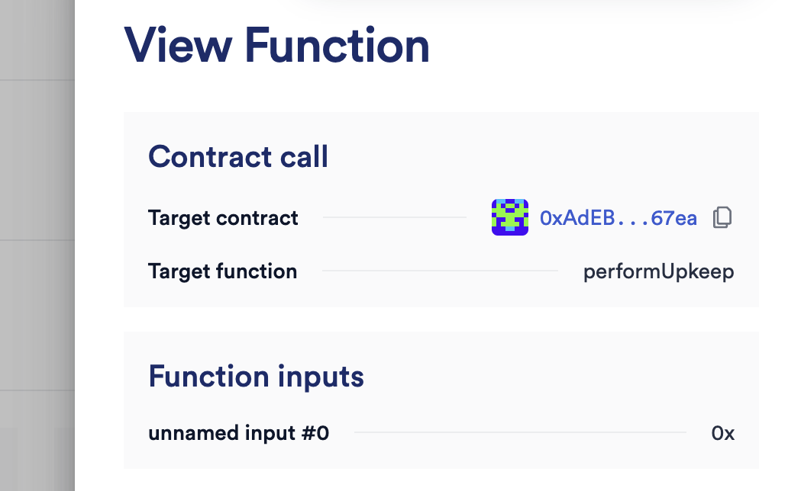

# Chainlink Automation

## setup

### install modules

```shell
yarn init

yarn add --dev hardhat

npx hardhat

yarn add --dev @nomicfoundation/hardhat-toolbox @nomicfoundation/hardhat-network-helpers @nomicfoundation/hardhat-chai-matchers @nomicfoundation/hardhat-ethers @nomicfoundation/hardhat-verify chai ethers hardhat-gas-reporter solidity-coverage @typechain/hardhat typechain @typechain/ethers-v6

yarn add @chainlink/contracts

yarn add @openzeppelin/contracts

yarn add --dev dotenv
```

### LINK Token
To run automation, LINK token si required.
It can be given from [here](https://faucets.chain.link/sepolia)

### Memo
Time-based Automation doesn't work for some reason.
Tx is [here](https://sepolia.etherscan.io/tx/0x70aed48a33950097a9746e849c202454f6e165ee254faf875a5d5d9e8b1bdcdc).
Similar problem is posted in [stackexchange](https://ethereum.stackexchange.com/questions/153877/chainlink-performupkeep-not-being-executed).

It seems docs and actual UI is different, so it's possible setup is wrong, especially there is no description about target function in time-based autmation although I simply input performUpkeep. Please let me know if it's wrong !


On the other hand, Custom Logic Automation works.
In Custom Logic Automation, checkUpkeep is called every block and execute performUpkeep if checkUpkeep return true, so it can be implemented like time-based using block.timestamp.
I think this is a practical solution. (2023/09/13)

### Links

- [Getting Started (Setup Contract)](https://docs.chain.link/chainlink-automation/compatible-contracts)
- [AutomationCompatibleInterface.sol](https://github.com/smartcontractkit/chainlink/blob/develop/contracts/src/v0.8/automation/interfaces/AutomationCompatibleInterface.sol)
- [Setup Time-based Automation](https://docs.chain.link/chainlink-automation/job-scheduler)
- [Setup Custom Logic Automation](https://docs.chain.link/chainlink-automation/register-upkeep)
- [Chainlink Automation App](https://automation.chain.link/)
- [Sample on Remix](https://remix.ethereum.org/#url=https://docs.chain.link/samples/Automation/AutomationCounter.sol&lang=en&optimize=false&runs=200&evmVersion=null&version=soljson-v0.8.18+commit.87f61d96.js)
- [LINK faucet in sepolia](https://faucets.chain.link/sepolia)